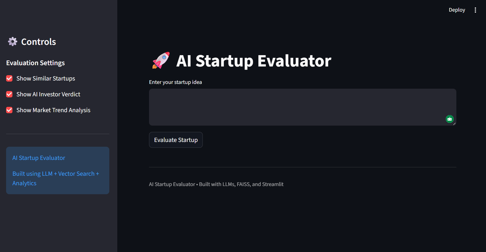
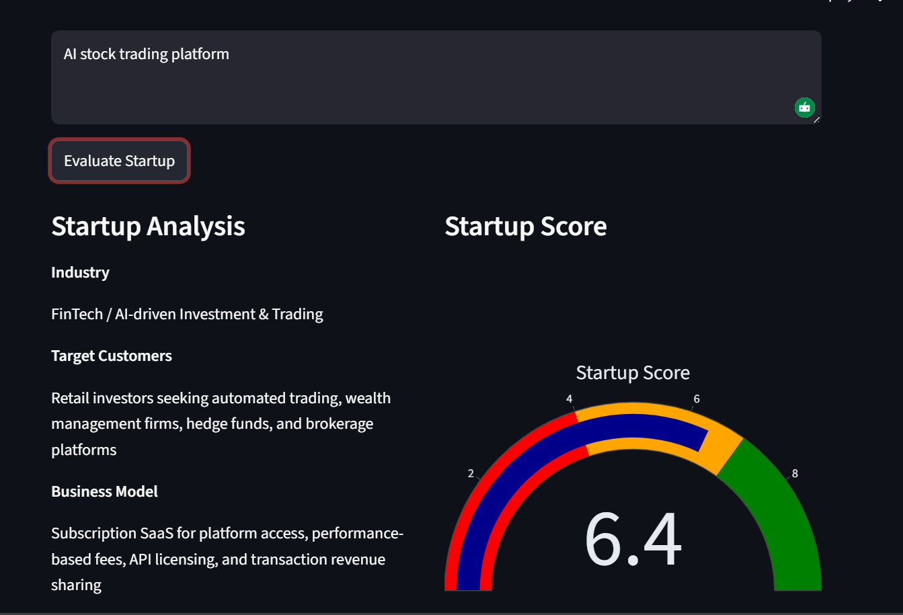
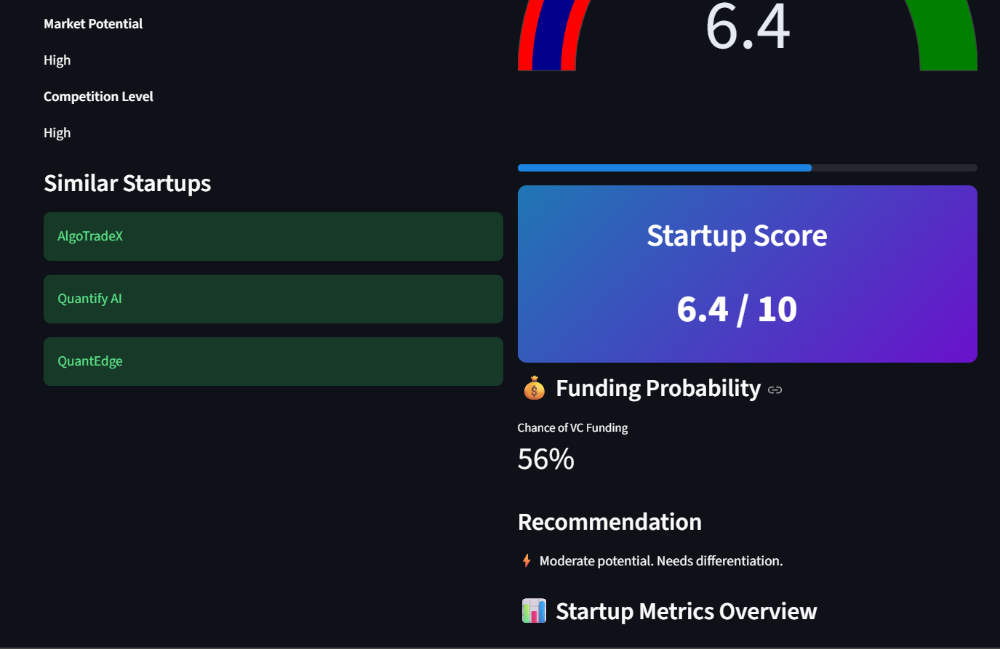
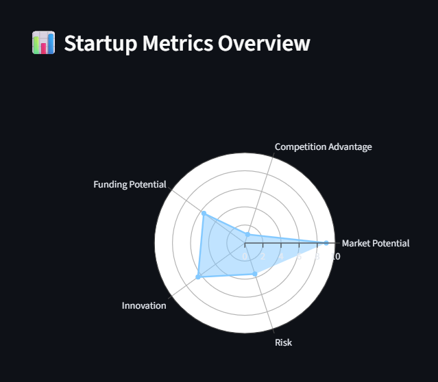

<div align="center">

# 🚀 AI Startup Evaluator

### *Simulate how venture capital firms assess startup ideas — powered by LLMs, vector search, and intelligent scoring models*

[](https://python.org)
[](https://streamlit.io)
[](https://groq.com)
[](https://faiss.ai)
[](LICENSE)

---

> Submit a startup idea. Get an instant VC-grade evaluation — complete with funding probability, competitor analysis, investor verdict, and a downloadable report.

---
## 🚀 Live Demo
https://ai-startup-evaluator.streamlit.app




</div>

---

## ✨ Features

| Feature | Description |
|---|---|
| 🤖 **AI Startup Analysis** | Extracts industry, target customers, business model, market potential & competition level |
| 📊 **Scoring Engine** | Rates ideas across market potential, competitive advantage, innovation, and risk |
| 💰 **Funding Predictor** | Estimates the probability of receiving venture capital funding |
| 🔎 **Similarity Search** | Finds comparable startups using Sentence Transformers + FAISS vector search |
| 🧠 **AI VC Verdict** | Generates an investor-style evaluation with strengths, risks & investment viability |
| 📈 **Market Trend Analysis** | Assesses industry growth trajectory and demand for the startup's space |
| 📄 **Downloadable Report** | Export a full evaluation PDF with all scores, analysis, and insights |

---

## 📸 Screenshots

<table>
  <tr>
    <td align="center"><br/><sub><b>Startup Analysis</b></sub></td>
    <td align="center"><br/><sub><b>Startup Score</b></sub></td>
  </tr>
  <tr>
    <td align="center" colspan="2"><br/><sub><b>Metrics Radar Chart</b></sub></td>
  </tr>
</table>

---

## 🧠 Tech Stack

| Category | Technology |
|---|---|
| **Language** | Python 3.10+ |
| **UI Framework** | Streamlit |
| **LLM API** | Groq |
| **Embeddings** | Sentence Transformers |
| **Vector Search** | FAISS |
| **Visualization** | Plotly |
| **Data** | CSV Dataset (~500 startups) |

---

## 🏗️ System Architecture

```
User Startup Idea
       │
       ▼
 LLM Startup Analyzer          ← Groq-powered idea decomposition
       │
       ▼
 Startup Scoring Engine        ← Multi-dimensional scoring (0–100)
       │
       ▼
 Funding Probability Predictor ← ML-based VC funding likelihood
       │
       ▼
 Vector Similarity Search      ← FAISS + Sentence Transformers
       │
       ▼
 AI VC Investor Verdict        ← LLM-generated investor memo
       │
       ▼
 Market Trend Analyzer         ← Industry growth & demand signals
       │
       ▼
 Interactive Streamlit Dashboard
```

---

## 📂 Project Structure

```
AI-Startup-Evaluator/
│
├── api/
│   └── main.py                   # FastAPI backend (optional)
│
├── app/
│   └── streamlit_app.py          # Main Streamlit UI
│
├── assets/
│   ├── dashboard.png
│   ├── startup-analysis.png
│   ├── startup-score.png
│   └── startup-metrics-overview.png
│
├── data/
│   └── startups.csv              # ~500 startup entries
│
├── scripts/
│   └── generate_startup_dataset.py
│
├── src/
│   ├── __init__.py
│   ├── idea_analyzer.py          # LLM-based idea extraction
│   ├── scoring_engine.py         # Multi-metric scoring
│   ├── funding_predictor.py      # Funding probability model
│   ├── similarity_search.py      # FAISS vector search
│   ├── investor_verdict.py       # AI investor memo generator
│   └── market_trends.py          # Market trend analysis
│
├── requirements.txt
└── README.md
```

---

## ⚙️ Installation

### 1. Clone the repository

```bash
git clone https://github.com/raj-singh1802/AI-Startup-Evaluator.git
cd AI-Startup-Evaluator
```

### 2. Create and activate a virtual environment

```bash
python -m venv venv

# Windows
venv\Scripts\activate

# macOS / Linux
source venv/bin/activate
```

### 3. Install dependencies

```bash
pip install -r requirements.txt
```

### 4. Set up environment variables

Create a `.env` file in the project root:

```env
GROQ_API_KEY=your_groq_api_key_here
```

> 🔑 Get your free Groq API key at [console.groq.com](https://console.groq.com)

---

## ▶️ Running the App

```bash
streamlit run app/streamlit_app.py
```

The app will open automatically in your browser at `http://localhost:8501`.

---

## 📊 Dataset Generation

Generate a synthetic dataset of ~500 AI startups for similarity search:

```bash
python scripts/generate_startup_dataset.py
```

This creates `data/startups.csv` with realistic startup profiles used for FAISS-powered comparisons.

---

## 📄 Evaluation Report

After analysis, users can download a full evaluation report including:

- ✅ Startup idea breakdown
- 📊 Scoring summary across all dimensions
- 💰 Funding probability estimate
- 🧠 AI investor verdict
- 📈 Market trend insights

---

## 🚀 Roadmap

- [ ] Real-time startup database integration
- [ ] Startup idea comparison tool (side-by-side analysis)
- [ ] AI startup idea generator
- [ ] Docker deployment support
- [ ] Integration with Crunchbase / Y Combinator datasets

---

## 👨‍💻 Author

<div align="center">

**Raj Singh**
*AI / Machine Learning Engineer*

[](https://github.com/raj-singh1802)

*If you found this project useful, consider giving it a ⭐ — it helps a lot!*

</div>
